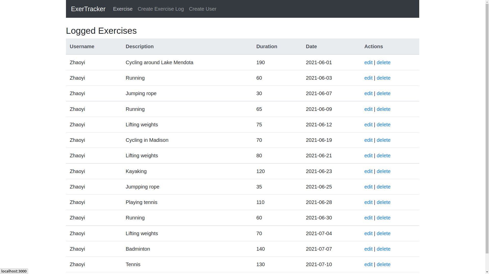
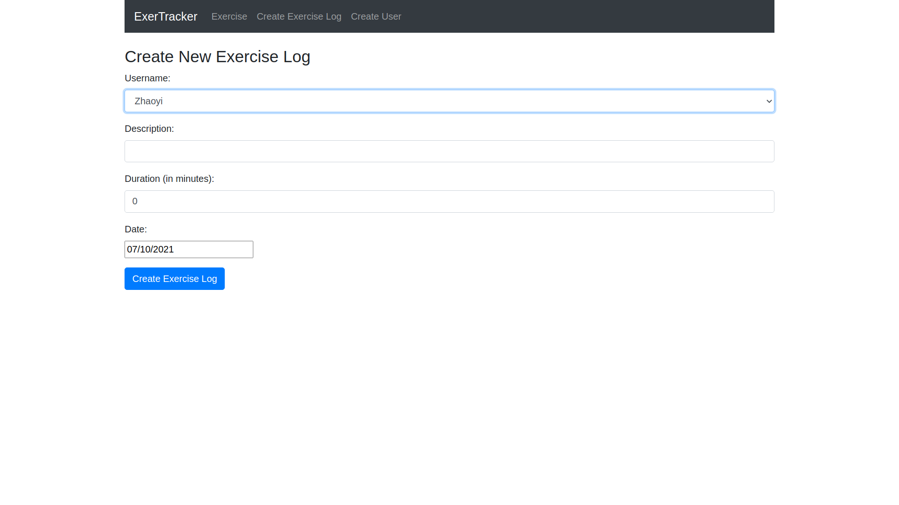

# exercise-tracker

An exercise tracker web application built with MERN (MongoDB, Express, React.js, Node.js) stack.

## Start the backend
> cd backend && node server

The backend will run on port 5000.

## Start the frontend
> npm start

The frontend will run on port 3000.

## Features
- Create users
- Create, update, delete exercise logs
- Read and display exercise logs

# Preview

Exercise list:

Create exercise:

